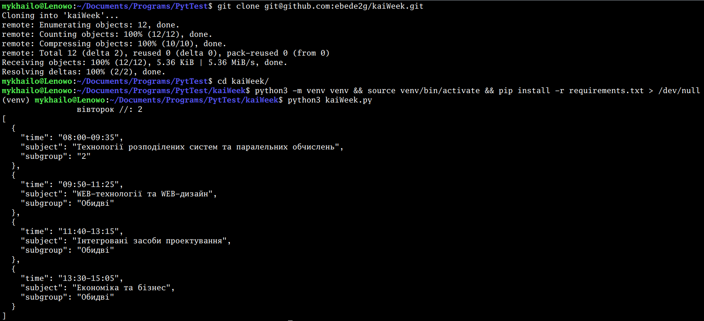

# kaiWeek
консольний прикол для моніторингу змін розкладу та його відображення

Див. 'kaiWeek.py' для налаштування групи та підгрупи. 

`git clone git@github.com:ebede2g/kaiWeek.git`

`python3 -m venv venv`

`source venv/bin/activate && pip install -r requirements.txt > /dev/null`

